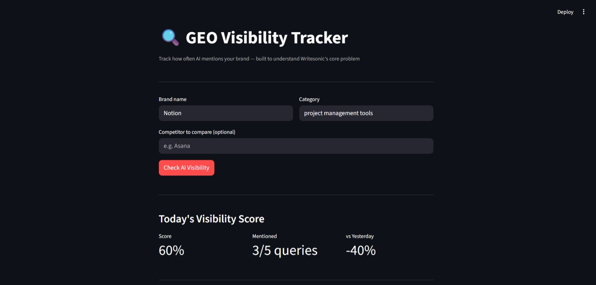

# GEO Visibility Tracker

A mini GEO (Generative Engine Optimization) platform that tracks 
how often AI models mention your brand — built to deeply understand 
the core problem Writesonic solves.

## Live Demo
👉 [geo-tracker-yourusername.streamlit.app](https://geo-tracker-lfpf8tqpdjz76lpg43rp65.streamlit.app/)

---

## What is GEO?

When someone asks ChatGPT *"best project management tool?"*, the AI 
picks 2–3 brands and recommends them directly. If your brand isn't 
mentioned — you're invisible to millions of people searching via AI.

GEO (Generative Engine Optimization) is the practice of making sure 
your brand shows up in AI answers — just like SEO made sure you 
showed up in Google results.

This is exactly the problem Writesonic's platform solves for 
20,000+ teams worldwide.

---

## What This App Does

- Sends 5 different AI prompts about your brand's category
- Detects whether your brand is mentioned in each answer
- Calculates a visibility score (0–100%)
- Saves results daily and detects score changes
- Compares your brand vs a competitor side by side
- Shows a 7-day trend chart of your visibility over time
- Alerts you when visibility drops significantly

---

## Screenshots

> Add screenshots here after deploying

---

## Tech Stack

| Tool | Purpose |
|---|---|
| Python | Core language |
| Groq API (Llama 3.3 70B) | AI model queries |
| Streamlit | Web dashboard UI |
| Pandas | Trend chart data |
| JSON | Daily result storage |

---

## Project Structure

geo-tracker/
├── dashboard.py     ← Streamlit web UI
├── tracker.py       ← Core GEO logic
├── prompts.py       ← AI query templates
├── storage.py       ← Save and load daily results
├── alerts.py        ← Change detection and alerts
├── requirements.txt ← Python dependencies
└── results/         ← Daily JSON result files

---

## How to Run Locally

**1. Clone the repo**
```bash
git clone https://github.com/yourusername/geo-tracker.git
cd geo-tracker
```

**2. Install dependencies**
```bash
pip install -r requirements.txt
```

**3. Add your API key**

Create a `.env` file:

GROQ_API_KEY=your-key-here


Get a free key at: console.groq.com — no card needed.

**4. Run the dashboard**
```bash
streamlit run dashboard.py
```

Open your browser at `http://localhost:8501`

---

## How It Works

User enters brand + category
↓
App generates 5 AI queries
↓
Groq AI answers each query
↓
App checks if brand is mentioned
↓
Calculates visibility score (%)
↓
Saves result with today's date
↓
Compares with yesterday's score
↓
Shows alert if score dropped

---

## Example Output

Brand: Notion
Category: project management tools
Query 1: What are the best project management tools?  ✅ Mentioned
Query 2: Which tool should a startup use?             ✅ Mentioned
Query 3: Compare the top 5 tools in detail            ❌ Not mentioned
Query 4: What are the best free tools?                ✅ Mentioned
Query 5: What do experts recommend in 2025?           ✅ Mentioned
Visibility Score: 80%  (4 out of 5)
vs Yesterday: -20% ⚠️ Drop detected

---

## Why I Built This

I'm applying to Writesonic as a Software Engineer and wanted to 
deeply understand the GEO problem they're solving. Building this 
project taught me:

- How LLM APIs work in production
- How brand detection works programmatically  
- How to track and compare AI responses over time
- How to build and deploy a full AI-powered product

This is a simplified version of Writesonic's core platform. 
Their real system tracks 120M+ AI conversations across 
ChatGPT, Gemini, Perplexity, and more.

---

## What I Would Build Next

- Multi-model support (ChatGPT, Gemini, Perplexity)
- Email alerts when visibility drops
- Historical trend over 30 days
- Source citation detection
- Multi-brand tracking dashboard
- Export results to CSV

---

## Author

**Sai Kiran**
Applying for Software Engineer role at Writesonic

- GitHub: [github.com/saikiranguduru2002](https://github.com/saikiranguduru2002)
- LinkedIn: [linkedin.com/in/guduru-saikiran-reddy](https://www.linkedin.com/in/guduru-saikiran-reddy-a78551235/)
- Email: saikiranguduru829@gmail.com
---

## License

MIT License — free to use and modify

